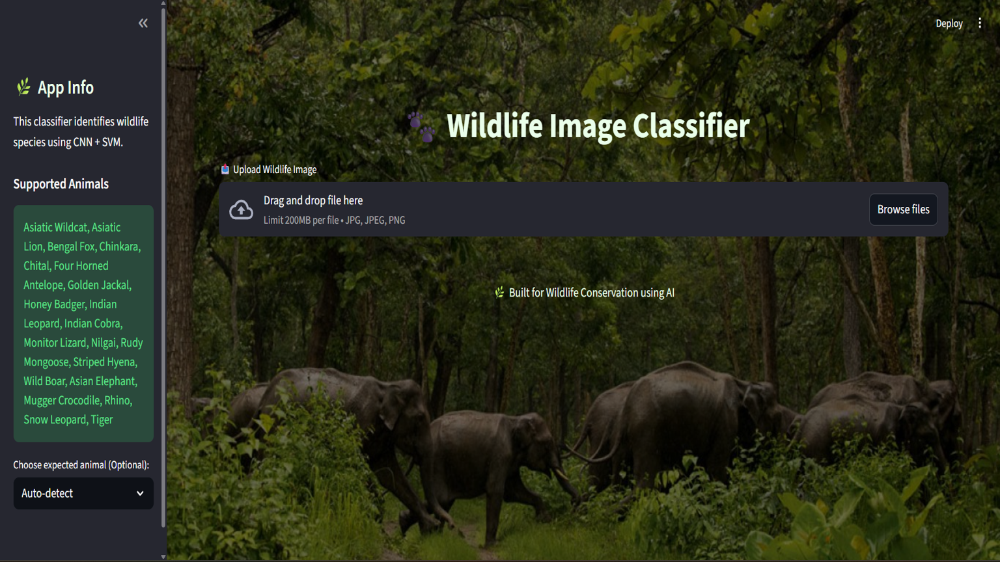
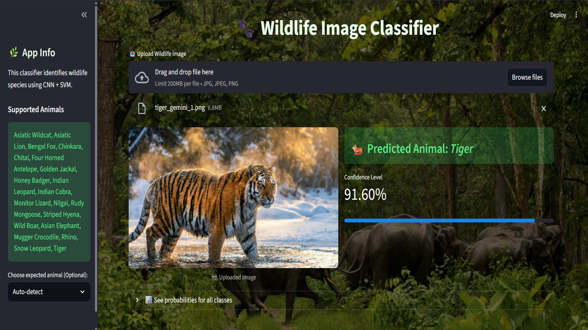

# 🐅 Indian Wildlife Image Classification

A machine learning project that classifies Indian wildlife species from images using **CNN (ResNet50)** for feature extraction and **SVM** for classification, deployed with **Streamlit**.

---

## 🔍 Overview

- Uses **ResNet50** (pre-trained CNN) to extract image features
- Uses **Support Vector Machine (SVM)** for classification
- Achieves **~88% accuracy**
- Deployed as a **Streamlit web application**

---

## 🧠 Technologies Used

- Python
- TensorFlow / Keras
- Scikit-learn (SVM)
- NumPy, Pandas
- Matplotlib
- Streamlit

---

## 🦁 Dataset

- Indian Wildlife Dataset (Camera-trap images)
- 20 wildlife species
- Real-world variations (lighting, background, angle)

---

## 📊 Model Performance

- **Accuracy:** ~88%
- **F1-score:** ~78%

---

**Confusion Matrix:**


---

## 🌐 Web Application

- Upload wildlife image
- Predict animal species
- Simple and user-friendly Streamlit interface

---

## 🖥️ Streamlit Application UI





---

## 🚀 How to Run

````bash
git clone https://github.com/your-username/indian-wildlife-classification.git
cd indian-wildlife-classification
pip install -r requirements.txt
streamlit run streamlit_2.py

---

## 📁 Project Structure

```text
├── dataset/
├── cnn_feature_extractor_resnet_final.h5
├── svm_model_resnet_final.joblib
├── train_cnn_svm_resnet50_final.py
├── streamlit_2.py
├── confusion_matrix_heatmap_final.png
├── requirements.txt
└── README.md
````

## 👨‍💻 Author

**Sagar Chavan**  
ML & AI Enthusiast
